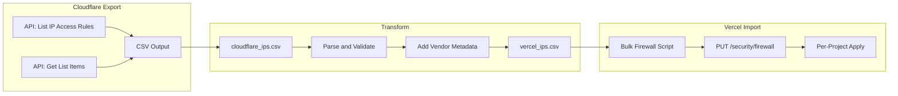

# Firewall IP Bypass Pivot for Crocs

## Understanding Access Control: Critical Context

Before recommending firewall bypass, it's important to understand the full picture of Vercel's access control options.

### Vercel Authentication vs. Company-Wide Access

**Vercel Authentication** (Deployment Protection = All / Team only) assumes the viewer is a Vercel user who has access to the team/project. It's great for "internal to the dev/org that's on Vercel," but it is **not** a fit for "all employees at a 100K-person company" if most of those people do not have Vercel accounts.

Key insight: **95K employees shouldn't need to know what Vercel is** just to access an internal tool.

### Two Common Access Models

#### Model 1: "Only dev/IT should access it"

Use **Deployment Protection → Vercel Authentication (All)**.

- Pros: Dead simple, strong default, no app changes required
- Cons: Viewers need Vercel accounts in the team

This is the recommended default for dev/staging environments.

#### Model 2: "Any employee can access it, but not the public"

You need **company SSO / IDP auth at the application or edge layer**, because Vercel's built-in "team-only" gating is tied to Vercel identities (team membership), not "anyone in the company directory."

Typical approaches:

| Approach | Description |

|----------|-------------|

| **SSO Integration** | Okta, Azure AD, Google Workspace via NextAuth, Auth0, SAML/OIDC |

| **Zero Trust Proxy** | Cloudflare Access, Zscaler, Tailscale |

| **IP Allowlisting** | VPN-only access, office IPs (limited, not as strong as SSO) |

### Important Nuance: Preventing "Accidental Public"

Even if you solve "employee auth," you still want to prevent accidental public exposure. Moving to a less strict protection mode can lead to "oops this is live" situations.

**Bottom line:**

- **Vercel Authentication** = Great for "Vercel users only" (dev teams)
- **SSO/Zero Trust** = Required for "all employees" access (most won't have Vercel seats)
- **Firewall IP Bypass** = For trusted vendor/partner IPs to bypass WAF rules

### Where This Tool Fits

The firewall bypass scripts in this plan are specifically for:

- External vendor/partner IPs that need to bypass WAF rules
- API integrations, payment gateways, monitoring services
- Scenarios where you trust certain IPs to not be challenged by WAF

It does NOT replace authentication - it complements it by allowing trusted external traffic through the WAF layer.

---

## Step 0: Export IPs from Cloudflare

Crocs needs to first export their ~600 vendor IPs from Cloudflare before importing to Vercel.

### UI Export: Not Available

**There is no CSV export feature in the Cloudflare dashboard.** You cannot download IP Access Rules or IP Lists directly from the UI.

### Method 1: Cloudflare API (Recommended)

Use the List IP Access Rules API to export all rules programmatically:

```bash
# Export all IP Access Rules for an account
curl "https://api.cloudflare.com/client/v4/accounts/{account_id}/firewall/access_rules/rules" \
  -H "Authorization: Bearer $CF_API_TOKEN" \
  -H "Content-Type: application/json" | jq '.result[] | {ip: .configuration.value, mode: .mode, notes: .notes}'
```

**For zone-level rules:**

```bash
curl "https://api.cloudflare.com/client/v4/zones/{zone_id}/firewall/access_rules/rules" \
  -H "Authorization: Bearer $CF_API_TOKEN" | jq '.result'
```

**Response structure:**

```json
{
  "result": [
    {
      "id": "92f17202ed8bd63d69a66b86a49a8f6b",
      "configuration": {
        "target": "ip",
        "value": "198.51.100.4"
      },
      "mode": "whitelist",
      "notes": "Vendor A - Acme Corp",
      "created_on": "2024-01-01T05:20:00Z"
    }
  ]
}
```

**Convert to CSV:**

```bash
curl "https://api.cloudflare.com/client/v4/accounts/{account_id}/firewall/access_rules/rules?mode=whitelist&per_page=1000" \
  -H "Authorization: Bearer $CF_API_TOKEN" | \
  jq -r '.result[] | [.configuration.value, .notes] | @csv' > cloudflare_ips.csv
```

### Method 2: Cloudflare CLI (flarectl)

Install flarectl and authenticate:

```bash
# Install
go install github.com/cloudflare/cloudflare-go/cmd/flarectl@latest

# Set credentials
export CF_API_TOKEN="your_token"

# List firewall rules (JSON output)
flarectl firewall rules list --zone=example.com --json
```

**Note:** flarectl is primarily for firewall rules, not IP Access Rules directly. For IP Access Rules, the API is more reliable.

### Method 3: If Using Cloudflare IP Lists (Modern Approach)

If Crocs is using the newer IP Lists feature (recommended by Cloudflare), use the Lists API:

```bash
# Get all lists
curl "https://api.cloudflare.com/client/v4/accounts/{account_id}/rules/lists" \
  -H "Authorization: Bearer $CF_API_TOKEN"

# Get items from a specific list
curl "https://api.cloudflare.com/client/v4/accounts/{account_id}/rules/lists/{list_id}/items" \
  -H "Authorization: Bearer $CF_API_TOKEN" | \
  jq -r '.result[] | [.ip, .comment] | @csv' > ip_list_export.csv
```

### Pagination for Large Lists (600+ IPs)

The API paginates results (default 25 per page, max 1000). For 600 IPs:

```bash
#!/bin/bash
# Export all pages of IP Access Rules
PAGE=1
while true; do
  RESPONSE=$(curl -s "https://api.cloudflare.com/client/v4/accounts/{account_id}/firewall/access_rules/rules?mode=whitelist&per_page=100&page=$PAGE" \
    -H "Authorization: Bearer $CF_API_TOKEN")
  
  COUNT=$(echo "$RESPONSE" | jq '.result | length')
  [ "$COUNT" -eq 0 ] && break
  
  echo "$RESPONSE" | jq -r '.result[] | [.configuration.value, .notes] | @csv'
  ((PAGE++))
done > cloudflare_all_ips.csv
```

### Cloudflare Export Script Recommendation

Create a dedicated `cloudflare-export.sh` script that:

1. Authenticates with Cloudflare API
2. Fetches all IP Access Rules (or IP List items) with pagination
3. Filters by `mode: whitelist` (allowlist rules only)
4. Outputs CSV in Vercel-compatible format: `IP,VendorName,Notes`
5. Handles both account-level and zone-level rules

---

## Key Finding: Wrong Feature

Your current scripts target **Trusted IPs** (deployment protection), but Crocs needs **Firewall bypass rules** (WAF bypass). These are completely different Vercel features.

| Feature | Trusted IPs | Firewall Bypass |

|---------|-------------|-----------------|

| Purpose | Protect deployment URLs (who can view) | WAF/firewall protection (block attacks, allow vendors) |

| Use Case | Restrict preview/prod access to team | Allow vendor IPs to bypass WAF rules |

| API | `PATCH /v9/projects/{id}` with `trustedIps` | `PUT/POST /security/firewall/{projectId}` |

| Limit | 20 IPs per project (raisable) | No documented hard limit |

---

## Firewall Scope: Per-Project (Not Org-Wide)

**Critical finding**: Firewall rules are **project-scoped**, not team/org-wide.

- Each project has its own firewall configuration
- Rules require `projectId` parameter
- Operates under team context (`teamId`) but configs are per-project
- For 600 IPs across N projects, you'd need to apply to each project

**Implication for Crocs**: If they have multiple projects, they'll need to either:

1. Apply the same IP list to each project via automation
2. Request a team-wide/org-wide feature from Vercel (feature request)

---

## Bulk Capabilities: Yes, It's Possible

### Method 1: Bulk PUT with IPs Array (Recommended)

The `PUT /security/firewall/{projectId}` endpoint accepts an `ips` array:

```json
{
  "firewallEnabled": true,
  "ips": [
    {"hostname": "*.crocs.com", "ip": "1.2.3.4", "action": "bypass", "notes": "Vendor A - Acme"},
    {"hostname": "*.crocs.com", "ip": "5.6.7.8/24", "action": "bypass", "notes": "Vendor B - Partner"},
    // ... up to N IPs in a single call
  ]
}
```

This allows **bulk updates in a single API call** per project.

### Method 2: Individual Bypass Rules

The `POST /v1/security/firewall/bypass` endpoint creates individual rules:

```json
{
  "projectScope": true,
  "sourceIp": "192.168.1.1",
  "note": "Vendor A - Acme Corp"
}
```

- One call per IP
- 600 IPs = 600 API calls (with rate limiting)
- More granular control, auditable per-rule

### Method 3: IP Access List via updateFirewallConfig

Using `POST /security/firewall/config/{projectId}` with `action: "ip.insert"`:

```json
{
  "action": "ip.insert",
  "value": {
    "hostname": "crocs.com",
    "ip": "192.168.1.1",
    "action": "bypass",
    "notes": "Vendor - Acme"
  }
}
```

---

## Vendor Tracking: Using Notes Field

Each API supports a `notes` field (max 500 chars for bypass, varies by endpoint):

```json
{
  "ip": "192.168.1.1",
  "action": "bypass",
  "notes": "Acme Corp | Contact: hunter@crocs.com | Added: 2026-01-26"
}
```

This provides vendor attribution per IP.

---

## New Automation Required

Your existing scripts **cannot be reused** for firewall bypass. They target the wrong API.

### New Script Requirements

1. **Different API endpoints**: `/v1/security/firewall/bypass` or `/security/firewall/{projectId}`
2. **Different request body structure**: Uses `ips` array or `sourceIp`
3. **Different semantics**: Bypass vs protection
4. **Multi-project support**: Loop over projects if needed

### Recommended Approach

Create new `vercel-firewall-bypass/` scripts that:

1. Read from CSV with format: `IP,CIDR,VendorName,VendorContact,Notes`
2. Use bulk PUT method for efficiency (single call per project)
3. Support dry-run mode
4. Provide rollback via GET + restore
5. Support multi-project deployment

---

## Recommended Implementation Tasks

1. **Create new firewall bypass script** using `PUT /security/firewall/{projectId}` with `ips` array
2. **Add multi-project support** to iterate over all Crocs projects
3. **Add vendor CSV parser** with columns: IP, CIDR, VendorName, VendorContact
4. **Add rollback capability** using `GET /v1/security/firewall/bypass` to backup current state
5. **Update customer guidance** to recommend Firewall bypass over Trusted IPs

---

## Rate Limits

For firewall endpoints, similar limits apply:

- ~100-120 requests/minute per team for write operations
- For bulk PUT, one call per project = N calls for N projects
- For 50 projects: ~50 API calls, ~30 seconds total

---

## End-to-End Migration Workflow



### Step-by-Step Process

1. **Export from Cloudflare** - Run export script to get all whitelisted IPs
2. **Transform CSV** - Add vendor metadata, validate IPs, format for Vercel
3. **Dry Run** - Test import with `DRY_RUN=true` on a single non-prod project
4. **Apply to Projects** - Run bulk import across all Crocs Vercel projects
5. **Verify** - Check Vercel dashboard to confirm rules are active
6. **Monitor** - Watch for any vendor access issues in first 24-48 hours

---

## Outstanding Questions for Crocs

1. **How many projects** do they need to apply this to?
2. **Do they want project-scoped or domain-scoped** bypass rules?
3. **What hostname pattern** should rules apply to (e.g., `*.crocs.com`)?
4. **Do they need TTL** (expiring rules) or permanent rules?
5. **Are their IPs in IP Access Rules or IP Lists** in Cloudflare? (affects export method)
6. **Account-level or zone-level** rules in Cloudflare? (affects export API endpoint)